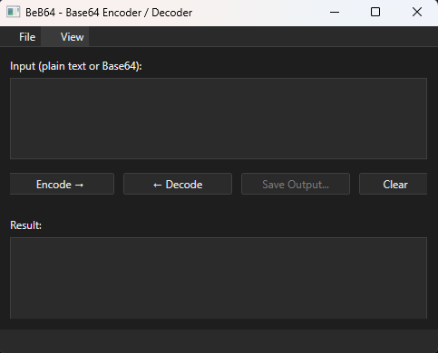
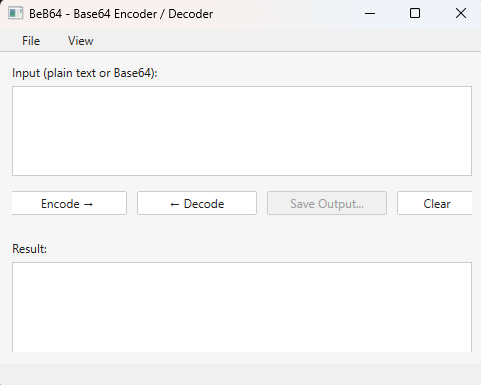

# **Base64 Encoder / Decoder**

A modern **WPF GUI application** for encoding and decoding Base64 text.  
Built with **.NET 8**, it provides a simple, clean, and fast interface for developers and casual users alike.

---

## **Features**

- **Encode / Decode Base64 text** instantly.
- **Light and Dark Theme** support (toggle via `View > Theme`).
- **Copy to Clipboard** and **Save to Text File** functionality.
- **Resizable UI** that scales gracefully.
- **Installer provided** for easy setup and uninstallation.
- **Built with .NET 8 WPF**, no runtime installation required (self-contained).

---

## **Screenshots**

<p align="center">
  
  
</p>

---

## **Download**

Get the latest version from the **[Releases](../../releases)** page:

- [Download Installer (Windows 64-bit)](../../releases/latest)

> **Note:** Windows SmartScreen might show a warning the first time because the installer is not code-signed. Click **"More info" → "Run anyway"** to continue.

---

## **Installation**

1. Download the latest installer from [Releases](../../releases).
2. Run the `Base64AppSetup.exe` file.
3. Follow the installation wizard to install the application.
4. (Optional) Create a desktop shortcut during installation.

---

## **Usage**

1. Launch **Base64 Encoder / Decoder**.
2. Paste or type your text into the **Input Box**.
3. Click **"Encode →"** or **"← Decode"**.
4. Copy the result to clipboard or save to file.

---

## **Build from Source**

To build this project locally:

### **Requirements**
- [Visual Studio 2022](https://visualstudio.microsoft.com/) with **.NET Desktop Development** workload.
- [.NET 8 SDK](https://dotnet.microsoft.com/download).

### **Steps**
```bash
git clone https://github.com/jloomis92/Beb64.GUI.git
cd Base64App
dotnet build
